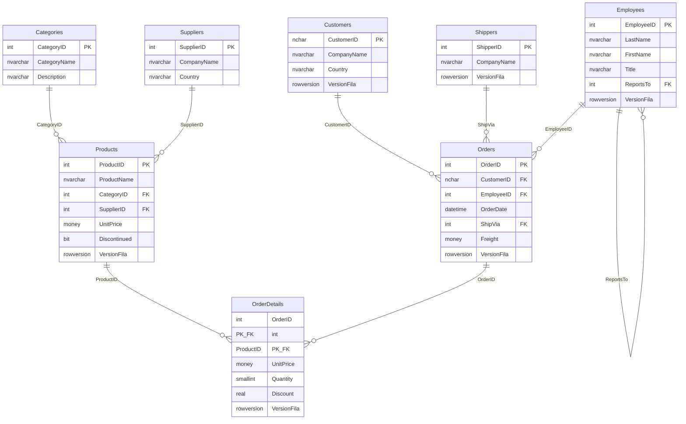
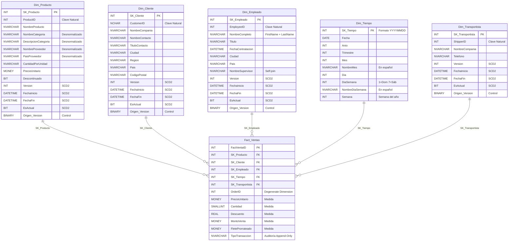
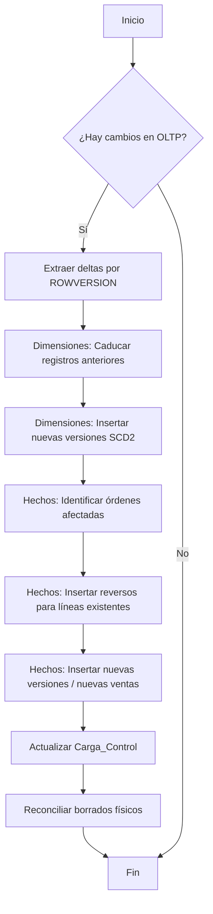

# Northwind OLTP & Data Warehouse

Repositorio de datos basado en la base de datos **Northwind** de Microsoft, implementando un esquema transaccional (OLTP) normalizado y su correspondiente **Data Warehouse** con modelo dimensional de estrella en **SQL Server**.

---

## 📋 Descripción del Proyecto

| Aspecto | Detalle |
|---|---|
| **Dominio** | Ventas (e-commerce / distribución de productos) |
| **Motor** | Microsoft SQL Server 2019+ |
| **OLTP** | Base de datos Northwind original (normalizada hasta 3FN) |
| **DW** | Modelo estrella con 1 tabla de hechos y 5 dimensiones |
| **Esquema** | `dbo` (esquema único) |
| **ETL** | Automatizado con SQL Server Agent Job (cada 1 minuto) |
| **Patrón** | Incremental (ROWVERSION) + SCD Tipo 2 + Append-Only |
| **BI** | Dashboard analítico en Power BI conectado al DW |

### Alcance del Sistema

El sistema OLTP gestiona el ciclo completo de ventas: clientes realizan pedidos, que son gestionados por empleados y entregados por transportistas. Los productos están organizados por categorías y abastecidos por proveedores.

El Data Warehouse está orientado a responder preguntas analíticas como:
- Tendencias de ventas por periodo (año, trimestre, mes, día de la semana)
- Productos y categorías más rentables (análisis Pareto ABC)
- Rendimiento de empleados y proveedores
- Análisis de mercados por país y región
- Distribución de costos de flete por transportista
- Estacionalidad semanal y variación mes a mes

---

## 🏗️ Modelo de Datos

### Modelo OLTP (Entidad-Relación)



### Modelo Estrella (Data Warehouse)



---

## 📁 Estructura del Repositorio

```
northwind/
├── README.md                              ← Este archivo
├── northwind.sql                          ← Script original Northwind (copia raíz)
├── .gitignore                             ← Reglas de exclusión para Git
├── OLTP/
│   ├── northwind.sql                      ← Script original Northwind (OLTP)
│   └── 02_agregar_rowversion.sql          ← Agrega ROWVERSION a 6 tablas OLTP
├── DW/
│   ├── 01_crear_base_datos_dw.sql         ← Crea la BD NorthwindDW
│   ├── 02_crear_dimensiones.sql           ← DDL de 5 dimensiones (SCD2)
│   ├── 03_crear_tabla_hechos.sql          ← DDL de Fact_Ventas (Append-Only) + 6 índices
│   ├── 04_crear_control_etl.sql           ← DDL de tabla Carga_Control + semillas
│   ├── 05_poblar_dim_tiempo.sql           ← Genera 1.096 fechas (1996–1998)
│   ├── 06_automatizacion_etl.sql          ← SP sp_ETL_CargaIncremental (SCD2 + Reversos)
│   ├── 07_crear_job_agente.sql            ← Crea el Job en SQL Server Agent
│   ├── 08_consultas_analiticas.sql        ← 13 consultas analíticas de ejemplo
│   └── legacy/                            ← Scripts de carga completa antiguos
│       ├── 05_poblar_dimensiones.sql      ← Carga directa de dimensiones (deprecado)
│       ├── 06_poblar_hechos.sql           ← Carga directa de hechos (deprecado)
│       ├── 08_automatizacion_etl.sql      ← ETL con ETL_Log (deprecado)
│       └── sp_ETL_CargaIncremental.sql    ← Versión anterior del SP (deprecado)
├── DACPAC/
│   ├── OLTP/
│   │   ├── OLTP.slnx                     ← Solución Visual Studio para OLTP
│   │   └── NorthWind_OLTP/               ← Proyecto SSDT para OLTP (PostDeploy)
│   └── DW/
│       ├── NorthwindDW.sln               ← Solución Visual Studio para DW
│       ├── NorthwindDW.sqlproj            ← Proyecto SSDT para DW
│       ├── sp_ETL_CargaIncremental.sql   ← SP dentro del proyecto SSDT
│       ├── Carga_Control.sql             ← DDL tabla de control
│       ├── Dim_*.sql                     ← DDL de dimensiones (5 archivos)
│       ├── Fact_Ventas.sql               ← DDL tabla de hechos
│       ├── IX_Fact_Ventas_*.sql          ← Índices (6 archivos)
│       └── Publish/                      ← Perfiles de publicación
├── PowerBI/
│   └── northwind.pbix                     ← Dashboard analítico Power BI
└── docs/
    └── modelo_estrella.md                 ← Documentación detallada del modelo
```

---

## 🚀 Instrucciones para Desplegar

### Requisitos Previos
- **SQL Server 2019** o superior (Developer / Standard / Enterprise)
- **SQL Server Management Studio (SSMS)** v18+
- **SQL Server Agent** activo (para automatización ETL — no disponible en Express)
- (Opcional) **Visual Studio 2022** con SQL Server Data Tools (SSDT) para el DACPAC
- (Opcional) **Power BI Desktop** para abrir el dashboard

### Paso 1: Crear la BD OLTP (Northwind)

```sql
-- Abrir SSMS, conectar al servidor y ejecutar:
-- Archivo: OLTP/northwind.sql
```

> ⚠️ **Nota:** El script original ejecuta `USE master` y crea la BD `Northwind` automáticamente.

### Paso 2: Agregar ROWVERSION al OLTP

```sql
-- Ejecutar sobre la BD Northwind recién creada:
-- Archivo: OLTP/02_agregar_rowversion.sql
```

> Este script agrega la columna `VersionFila` (ROWVERSION) a las 6 tablas clave: `Products`, `Customers`, `Employees`, `Shippers`, `Orders` y `Order Details`. Es **idempotente** (verifica existencia antes de agregar).

### Paso 3: Crear el Data Warehouse

Ejecutar los scripts **en orden secuencial** en SSMS:

```
1. DW/01_crear_base_datos_dw.sql     → Crea la BD NorthwindDW
2. DW/02_crear_dimensiones.sql       → Crea las 5 tablas de dimensiones (SCD2)
3. DW/03_crear_tabla_hechos.sql      → Crea Fact_Ventas con FK y 6 índices (Append-Only)
4. DW/04_crear_control_etl.sql       → Crea la tabla Carga_Control + 6 registros semilla
5. DW/05_poblar_dim_tiempo.sql       → Genera 1.096 registros de fecha (1996–1998)
6. DW/06_automatizacion_etl.sql      → Crea SP sp_ETL_CargaIncremental
7. DW/07_crear_job_agente.sql        → Crea el Job en SQL Server Agent (requiere Agent activo)
8. DW/08_consultas_analiticas.sql    → 13 consultas analíticas para validar el DW
```

### Paso 4: Generar el DACPAC (Opcional)

1. Abrir `DACPAC/DW/NorthwindDW.sln` en Visual Studio 2022
2. Click derecho en el proyecto → **Build**
3. El archivo `.dacpac` se generará en `bin/Debug/NorthwindDW.dacpac`

### Paso 5: Conectar Power BI (Opcional)

1. Abrir `PowerBI/northwind.pbix` en Power BI Desktop
2. Verificar la conexión al servidor SQL Server local
3. Refrescar los datos para cargar el modelo estrella

---

## 📊 Métricas del Data Warehouse

| Métrica | Descripción | Fórmula |
|---|---|---|
| **Ventas Totales** | Monto total facturado | `SUM(MontoVenta)` |
| **Unidades Vendidas** | Cantidad de productos | `SUM(Cantidad)` |
| **Flete Total** | Costo de envío prorrateado | `SUM(FleteProrrateado)` |
| **Descuento Promedio** | Porcentaje medio de descuento | `AVG(Descuento) × 100` |
| **Ticket Promedio** | Monto promedio por orden | `SUM(MontoVenta) / COUNT(DISTINCT OrderID)` |

### Fórmula de Prorrateo de Flete

El flete (`Freight`) se registra a nivel de orden. Para distribuirlo a nivel de línea de detalle:

```
FleteProrrateado = Freight × (MontoLinea / SubtotalOrden)
```

Donde `SubtotalOrden = SUM(UnitPrice × Quantity × (1 - Discount))` para todas las líneas del mismo `OrderID`.

**Propiedad:** `SUM(FleteProrrateado) GROUP BY OrderID ≈ Orders.Freight` (con mínima diferencia por redondeo de punto flotante).

---

## 🔄 Automatización ETL

El script `06_automatizacion_etl.sql` implementa el Stored Procedure que orquesta la actualización automática del DW:

| Componente | Descripción |
|---|---|
| `dbo.Carga_Control` | Tabla que almacena el último ROWVERSION procesado por cada tabla OLTP |
| `dbo.sp_ETL_CargaIncremental` | Stored Procedure que orquesta la carga incremental, SCD2 y reconciliación de borrados |
| `Job_ETL_NorthwindDW` | SQL Server Agent Job programado cada 1 minuto |

### Patrón de Integración

| Característica | Valor |
|---|---|
| **Dirección** | Unidireccional (OLTP → DW, nunca al revés) |
| **Mecanismo** | PULL — El DW extrae datos del OLTP (filtrado por ROWVERSION) |
| **Tipo de carga** | Incremental + SCD Tipo 2 en dimensiones |
| **Tabla de hechos** | Append-Only con asientos de reverso (no UPDATE ni DELETE) |
| **Reconciliación** | Detecta borrados físicos en OLTP e inserta reversos en el DW |
| **Frecuencia** | Cada 1 minuto (configurable en el Job) |

### Flujo del SP `sp_ETL_CargaIncremental`



### Tipos de Transacción en `Fact_Ventas`

| TipoTransaccion | Descripción |
|---|---|
| `Venta Original` | Primera inserción de una línea de detalle |
| `Reverso por Actualización` | Contrapartida negativa antes de re-insertar la línea modificada |
| `Nueva Versión` | Línea re-insertada con valores actualizados |
| `Reverso por Borrado` | Contrapartida negativa para una línea eliminada del OLTP |

### Comandos Útiles

```sql
-- Ejecutar ETL manualmente:
EXEC dbo.sp_ETL_CargaIncremental;

-- Verificar tabla de control:
SELECT * FROM dbo.Carga_Control;

-- Iniciar Job manualmente:
EXEC msdb.dbo.sp_start_job @job_name = N'Job_ETL_NorthwindDW';

-- Desactivar el Job:
EXEC msdb.dbo.sp_update_job @job_name = N'Job_ETL_NorthwindDW', @enabled = 0;
```

---

## 📈 Consultas Analíticas

El script `08_consultas_analiticas.sql` incluye **13 consultas** que demuestran el uso del modelo estrella:

| # | Consulta | Técnica SQL |
|---|---|---|
| 1 | Ventas por año y trimestre | `GROUP BY`, `SUM` |
| 2 | Top 10 productos por monto | `TOP`, `ORDER BY DESC` |
| 3 | Ventas por categoría | `SUM() OVER()` (% del total) |
| 4 | Ranking de empleados | `RANK() OVER()` |
| 5 | Ventas por país del cliente | `COUNT(DISTINCT)`, Ticket promedio |
| 6 | Flete por transportista | Distribución de costos |
| 7 | Variación mensual | `LAG()` con CTE |
| 8 | Descuentos por categoría | Análisis de políticas comerciales |
| 9 | Top 5 clientes por país | `ROW_NUMBER() OVER(PARTITION BY)` |
| 10 | Análisis de Pareto (ABC) | Clasificación A/B/C acumulada |
| 11 | Rendimiento de proveedores | Volumen y ventas por proveedor |
| 12 | Ventas por día de la semana | Estacionalidad semanal |
| 13 | Resumen ejecutivo del DW | KPIs globales consolidados |

---

## 👤 Autor

- **Curso:** Módulo II — Ciencia de Datos, UMSS
- **Tarea:** Tarea I — Diseño de BD OLTP y Data Warehouse
- **Fecha:** Mayo 2026
