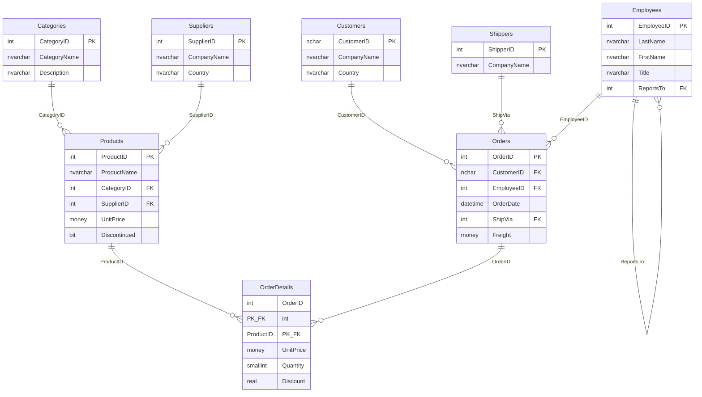
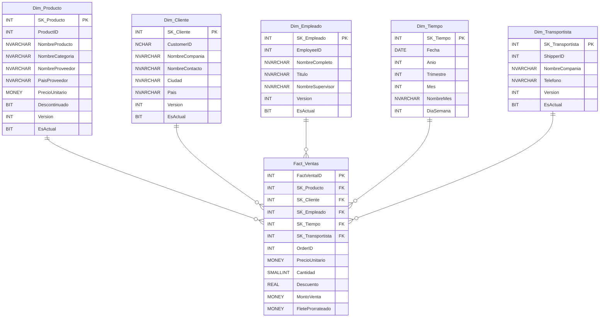

# Northwind OLTP & Data Warehouse

Repositorio de datos basado en la base de datos **Northwind** de Microsoft, implementando un esquema transaccional (OLTP) normalizado y su correspondiente **Data Warehouse** con modelo dimensional de estrella en **SQL Server**.

---

## 📋 Descripción del Proyecto

| Aspecto | Detalle |
|---|---|
| **Dominio** | Ventas (e-commerce / distribución de productos) |
| **Motor** | Microsoft SQL Server 2019+ |
| **OLTP** | Base de datos Northwind original (normalizada hasta 3FN) |
| **DW** | Modelo estrella con 1 tabla de hechos y 5 dimensiones |
| **Esquema** | `dbo` (esquema único) |
| **ETL** | Automatizado con SQL Server Agent Job (cada 1 minuto) |
| **Patrón** | Incremental (MERGE con ROWVERSION) y SCD Tipo 2 |

### Alcance del Sistema

El sistema OLTP gestiona el ciclo completo de ventas: clientes realizan pedidos, que son gestionados por empleados y entregados por transportistas. Los productos están organizados por categorías y abastecidos por proveedores.

El Data Warehouse está orientado a responder preguntas analíticas como:
- Tendencias de ventas por periodo (año, trimestre, mes)
- Productos y categorías más rentables
- Rendimiento de empleados
- Análisis de mercados por país
- Distribución de costos de flete por transportista

---

## 🏗️ Modelo de Datos

### Modelo OLTP (Entidad-Relación)



### Modelo Estrella (Data Warehouse)



---

## 📁 Estructura del Repositorio

```
northwind/
├── README.md                              ← Este archivo
├── OLTP/
│   ├── northwind.sql                      ← Script original Northwind (OLTP)
│   └── 02_agregar_rowversion.sql          ← Agrega ROWVERSION a las tablas
├── DW/
│   ├── 01_crear_base_datos_dw.sql         ← Crea la BD NorthwindDW
│   ├── 02_crear_dimensiones.sql           ← DDL de dimensiones (SCD2, sin UNIQUE)
│   ├── 02b_crear_control_etl.sql          ← DDL de tabla Carga_Control
│   ├── 03_crear_tabla_hechos.sql          ← DDL de Fact_Ventas + índices
│   ├── 04_poblar_dim_tiempo.sql           ← Genera fechas 1996-1998
│   ├── 05_poblar_dimensiones.sql          ← (Legado) Carga inicial sin versiones
│   ├── 06_poblar_hechos.sql               ← ETL: Poblar Fact_Ventas con prorrateo
│   ├── 07_consultas_analiticas.sql        ← 10 consultas analíticas de ejemplo
│   ├── 08_automatizacion_etl.sql          ← (Legado) SP de carga completa
│   └── 08b_automatizacion_etl_scd.sql     ← SP Incremental con SCD2 + Job config
├── DACPAC/
│   ├── OLTP/
│   │   └── NorthWind_OLTP/                ← Proyecto SSDT para OLTP (PostDeploy)
│   └── DW/
│       ├── NorthwindDW.sqlproj            ← Proyecto SSDT para DW
│       └── *.sql                          ← Definiciones de tablas (8 archivos)
└── docs/
    └── modelo_estrella.md                 ← Documentación detallada del modelo
```

---

## 🚀 Instrucciones para Desplegar

### Requisitos Previos
- **SQL Server 2019** o superior (Developer / Standard / Enterprise)
- **SQL Server Management Studio (SSMS)** v18+
- **SQL Server Agent** activo (para automatización ETL — no disponible en Express)
- (Opcional) **Visual Studio 2022** con SQL Server Data Tools (SSDT) para el DACPAC

### Paso 1: Crear la BD OLTP (Northwind)

```sql
-- Abrir SSMS, conectar al servidor y ejecutar:
-- Archivo: OLTP/northwind.sql
```

> ⚠️ **Nota:** El script original ejecuta `USE master` y crea la BD `Northwind` automáticamente.

### Paso 2: Crear el Data Warehouse

Ejecutar los scripts **en orden secuencial** en SSMS:

```
1. DW/01_crear_base_datos_dw.sql     → Crea la BD NorthwindDW
2. DW/02_crear_dimensiones.sql       → Crea las 5 tablas de dimensiones (SCD2)
3. DW/02b_crear_control_etl.sql      → Crea la tabla Carga_Control
4. DW/03_crear_tabla_hechos.sql      → Crea Fact_Ventas con FK e índices
5. DW/04_poblar_dim_tiempo.sql       → Genera 1,096 registros de fecha
6. DW/06_poblar_hechos.sql           → Carga Fact_Ventas (Carga inicial)
7. DW/08b_automatizacion_etl_scd.sql → Crea SP Incremental y actualiza el Job
```

### Paso 3: Generar el DACPAC (Opcional)

1. Abrir `DACPAC/DW/NorthwindDW.sqlproj` en Visual Studio 2022
2. Click derecho en el proyecto → **Build**
3. El archivo `.dacpac` se generará en `bin/Debug/NorthwindDW.dacpac`

---

## 📊 Métricas del Data Warehouse

| Métrica | Descripción | Fórmula |
|---|---|---|
| **Ventas Totales** | Monto total facturado | `SUM(MontoVenta)` |
| **Unidades Vendidas** | Cantidad de productos | `SUM(Cantidad)` |
| **Flete Total** | Costo de envío prorrateado | `SUM(FleteProrrateado)` |
| **Descuento Promedio** | Porcentaje medio de descuento | `AVG(Descuento) × 100` |
| **Ticket Promedio** | Monto promedio por orden | `SUM(MontoVenta) / COUNT(DISTINCT OrderID)` |

### Fórmula de Prorrateo de Flete

El flete (`Freight`) se registra a nivel de orden. Para distribuirlo a nivel de línea de detalle:

```
FleteProrrateado = Freight × (MontoLinea / SubtotalOrden)
```

Donde `SubtotalOrden = SUM(UnitPrice × Quantity × (1 - Discount))` para todas las líneas del mismo `OrderID`.

---

## 🔄 Automatización ETL

El script `08_automatizacion_etl.sql` implementa la actualización automática del DW:

| Componente | Descripción |
|---|---|
| `dbo.ETL_Log` | Tabla de auditoría que registra cada ejecución |
| `dbo.Carga_Control` | Tabla que almacena el último ROWVERSION de las tablas OLTP |
| `dbo.sp_ETL_CargaIncremental` | Stored Procedure que orquesta la carga incremental y SCD2 |
| `Job_ETL_NorthwindDW` | SQL Server Agent Job programado cada 1 minuto |

### Patrón de Integración

| Característica | Valor |
|---|---|
| **Dirección** | Unidireccional (OLTP → DW, nunca al revés) |
| **Mecanismo** | PULL — El DW extrae datos del OLTP (Filtrado por ROWVERSION) |
| **Tipo de carga** | Incremental (MERGE) + Histórico (SCD Tipo 2) |
| **Frecuencia** | Cada 1 minuto (configurable) |

### Comandos Útiles

```sql
-- Ejecutar ETL manualmente:
EXEC dbo.sp_ETL_CargaCompleta;

-- Ver historial de ejecuciones:
SELECT * FROM dbo.ETL_Log ORDER BY LogID DESC;

-- Iniciar Job manualmente:
EXEC msdb.dbo.sp_start_job @job_name = N'Job_ETL_NorthwindDW';

-- Desactivar el Job:
EXEC msdb.dbo.sp_update_job @job_name = N'Job_ETL_NorthwindDW', @enabled = 0;
```

---

## 👤 Autor

- **Curso:** Módulo II — Ciencia de Datos, UMSS
- **Tarea:** Tarea I — Diseño de BD OLTP y Data Warehouse
- **Fecha:** Mayo 2026
