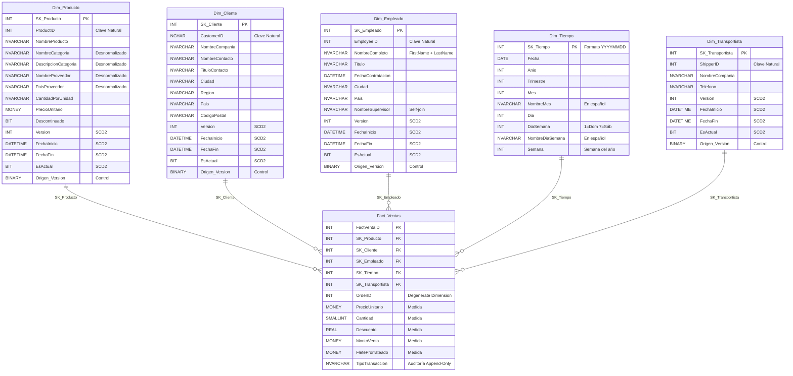

# Modelo Estrella — Northwind Data Warehouse

## Descripción General

El Data Warehouse **NorthwindDW** implementa un **modelo estrella** (star schema) orientado al análisis de ventas. El diseño sigue las mejores prácticas de modelado dimensional de Ralph Kimball.

---

## Diagrama del Modelo Estrella



---

## Tabla de Hechos: `Fact_Ventas`

### Granularidad
**Una fila por cada línea de detalle de orden.** Este es el nivel más fino disponible en el OLTP, lo que permite máxima flexibilidad analítica.

### Patrón Append-Only
La tabla de hechos **nunca** recibe `UPDATE` ni `DELETE`. Las modificaciones y eliminaciones en el OLTP se reflejan mediante **asientos de reverso** (filas con cantidades y montos negativos), preservando un historial inmutable de auditoría.

| TipoTransaccion | Descripción |
|---|---|
| `Venta Original` | Primera inserción de una línea de detalle |
| `Reverso por Actualización` | Contrapartida negativa antes de re-insertar la línea modificada |
| `Nueva Versión` | Línea re-insertada con valores actualizados |
| `Reverso por Borrado` | Contrapartida negativa para una línea eliminada físicamente del OLTP |

### Dimensiones Degeneradas
- `OrderID`: Clave natural del pedido, almacenada directamente en la tabla de hechos (no requiere tabla de dimensión propia).

### Métricas

| Métrica | Tipo | Fórmula / Origen |
|---|---|---|
| `PrecioUnitario` | Semi-aditiva | `[Order Details].UnitPrice` — Precio en el momento de la venta |
| `Cantidad` | Aditiva | `[Order Details].Quantity` — Unidades vendidas |
| `Descuento` | No aditiva | `[Order Details].Discount` — Porcentaje (0.00 - 1.00) |
| `MontoVenta` | Aditiva | `UnitPrice × Quantity × (1 - Discount)` |
| `FleteProrrateado` | Aditiva | `Freight × (MontoLinea / SubtotalOrden)` |

### Índices

La tabla cuenta con **6 índices no agrupados** para optimizar las consultas de tipo star join:

| Índice | Columna |
|---|---|
| `IX_Fact_Ventas_Producto` | `SK_Producto` |
| `IX_Fact_Ventas_Cliente` | `SK_Cliente` |
| `IX_Fact_Ventas_Empleado` | `SK_Empleado` |
| `IX_Fact_Ventas_Tiempo` | `SK_Tiempo` |
| `IX_Fact_Ventas_Transportista` | `SK_Transportista` |
| `IX_Fact_Ventas_OrderID` | `OrderID` |

### Fórmula de Prorrateo del Flete

El campo `Freight` de la tabla `Orders` se encuentra a nivel de orden completa. Para distribuirlo proporcionalmente a cada línea de detalle:

```
FleteProrrateado = Orders.Freight × ( MontoLineaActual / SubtotalOrden )

Donde:
  MontoLineaActual = UnitPrice × Quantity × (1 - Discount)
  SubtotalOrden    = SUM(UnitPrice × Quantity × (1 - Discount)) 
                     para todas las líneas del mismo OrderID
```

**Propiedad:** `SUM(FleteProrrateado) GROUP BY OrderID ≈ Orders.Freight` (con mínima diferencia por redondeo de punto flotante).

---

## Dimensiones

### `Dim_Producto` — SCD Tipo 2
Desnormalización de 3 tablas OLTP: `Products`, `Categories`, `Suppliers`.
Implementa Slowly Changing Dimension (SCD) Tipo 2 para rastrear el historial de cambios en datos críticos como `PrecioUnitario` o cambio de proveedor.

| Campo | Origen OLTP |
|---|---|
| `NombreProducto` | `Products.ProductName` |
| `NombreCategoria` | `Categories.CategoryName` |
| `DescripcionCategoria` | `Categories.Description` |
| `NombreProveedor` | `Suppliers.CompanyName` |
| `PaisProveedor` | `Suppliers.Country` |
| `CantidadPorUnidad` | `Products.QuantityPerUnit` |
| `PrecioUnitario` | `Products.UnitPrice` |
| `Descontinuado` | `Products.Discontinued` |

| Jerarquía | Campos |
|---|---|
| Categoría → Producto | `NombreCategoria` → `NombreProducto` |
| País Proveedor → Proveedor → Producto | `PaisProveedor` → `NombreProveedor` → `NombreProducto` |

### `Dim_Cliente` — SCD Tipo 2
Fuente: `Customers`. Incluye jerarquía geográfica.

| Campo | Origen OLTP |
|---|---|
| `NombreCompania` | `Customers.CompanyName` |
| `NombreContacto` | `Customers.ContactName` |
| `TituloContacto` | `Customers.ContactTitle` |
| `Ciudad` | `Customers.City` |
| `Region` | `Customers.Region` |
| `Pais` | `Customers.Country` |
| `CodigoPostal` | `Customers.PostalCode` |

| Jerarquía | Campos |
|---|---|
| País → Región → Ciudad → Cliente | `Pais` → `Region` → `Ciudad` → `NombreCompania` |

### `Dim_Empleado` — SCD Tipo 2
Fuente: `Employees` con self-join. Incluye jerarquía organizacional.

| Campo | Origen OLTP |
|---|---|
| `NombreCompleto` | `Employees.FirstName + ' ' + LastName` |
| `Titulo` | `Employees.Title` |
| `FechaContratacion` | `Employees.HireDate` |
| `Ciudad` | `Employees.City` |
| `Pais` | `Employees.Country` |
| `NombreSupervisor` | Self-join a `Employees.ReportsTo` |

| Jerarquía | Campos |
|---|---|
| Supervisor → Empleado | `NombreSupervisor` → `NombreCompleto` |

### `Dim_Tiempo`
Generada automáticamente. Rango: **1996-01-01** a **1998-12-31** (1.096 días).

| Campo | Descripción |
|---|---|
| `SK_Tiempo` | Clave en formato `YYYYMMDD` (ej. `19960715`) |
| `Fecha` | Fecha tipo `DATE` |
| `Anio` | Año (1996, 1997, 1998) |
| `Trimestre` | 1 a 4 |
| `Mes` | 1 a 12 |
| `NombreMes` | En español (Enero … Diciembre) |
| `Dia` | Día del mes (1–31) |
| `DiaSemana` | 1=Domingo … 7=Sábado |
| `NombreDiaSemana` | En español (Lunes … Domingo) |
| `Semana` | Semana del año (1–53) |

| Jerarquía | Campos |
|---|---|
| Año → Trimestre → Mes → Día | `Anio` → `Trimestre` → `NombreMes` → `Dia` |
| Semana → Día de la Semana | `Semana` → `NombreDiaSemana` |

### `Dim_Transportista` — SCD Tipo 2
Fuente: `Shippers`. Dimensión plana sin jerarquías.

| Campo | Origen OLTP |
|---|---|
| `NombreCompania` | `Shippers.CompanyName` |
| `Telefono` | `Shippers.Phone` |

---

## Campos SCD Tipo 2 (Comunes a Dimensiones)

Todas las dimensiones (excepto `Dim_Tiempo`) implementan los siguientes campos de control:

| Campo | Tipo | Propósito |
|---|---|---|
| `Version` | `INT` | Número secuencial de versión del registro |
| `FechaInicio` | `DATETIME` | Fecha en que esta versión se activó |
| `FechaFin` | `DATETIME` | Fecha de caducidad (`NULL` si es la versión activa) |
| `EsActual` | `BIT` | `1` = versión vigente, `0` = histórica |
| `Origen_Version` | `BINARY(8)` | ROWVERSION del OLTP que originó esta versión |

---

## Mapeo OLTP → DW

| Tabla OLTP | Tabla DW | Tipo |
|---|---|---|
| `Products` + `Categories` + `Suppliers` | `Dim_Producto` | Dimensión |
| `Customers` | `Dim_Cliente` | Dimensión |
| `Employees` | `Dim_Empleado` | Dimensión |
| *(Generada)* | `Dim_Tiempo` | Dimensión |
| `Shippers` | `Dim_Transportista` | Dimensión |
| `Orders` + `Order Details` | `Fact_Ventas` | Hechos |

---

## Consultas Analíticas Disponibles

El script `08_consultas_analiticas.sql` incluye **13 consultas** que demuestran el uso del modelo estrella:

| # | Consulta | Técnica SQL |
|---|---|---|
| 1 | Ventas por año y trimestre | `GROUP BY`, `SUM` |
| 2 | Top 10 productos por monto | `TOP`, `ORDER BY DESC` |
| 3 | Ventas por categoría con % del total | `SUM() OVER()` |
| 4 | Ranking de empleados | `RANK() OVER()` |
| 5 | Ventas por país del cliente | `COUNT(DISTINCT)`, Ticket promedio |
| 6 | Flete por transportista | Distribución de costos |
| 7 | Variación mensual de ventas | `LAG()` con CTE |
| 8 | Descuentos por categoría | Análisis de políticas comerciales |
| 9 | Top 5 clientes por país | `ROW_NUMBER() OVER(PARTITION BY)` |
| 10 | Análisis de Pareto (ABC) | Clasificación A/B/C acumulada |
| 11 | Rendimiento de proveedores | Volumen y ventas por proveedor |
| 12 | Ventas por día de la semana | Estacionalidad semanal |
| 13 | Resumen ejecutivo del DW | KPIs globales consolidados |
