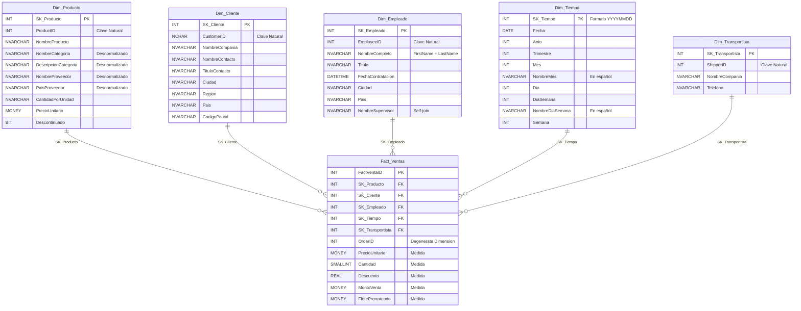

# Modelo Estrella — Northwind Data Warehouse

## Descripción General

El Data Warehouse **NorthwindDW** implementa un **modelo estrella** (star schema) orientado al análisis de ventas. El diseño sigue las mejores prácticas de modelado dimensional de Ralph Kimball.

---

## Diagrama del Modelo Estrella



---

## Tabla de Hechos: `Fact_Ventas`

### Granularidad
**Una fila por cada línea de detalle de orden.** Este es el nivel más fino disponible en el OLTP, lo que permite máxima flexibilidad analítica.

### Dimensiones Degeneradas
- `OrderID`: Clave natural del pedido, almacenada directamente en la tabla de hechos (no requiere tabla de dimensión propia).

### Métricas

| Métrica | Tipo | Fórmula / Origen |
|---|---|---|
| `PrecioUnitario` | Semi-aditiva | `[Order Details].UnitPrice` — Precio en el momento de la venta |
| `Cantidad` | Aditiva | `[Order Details].Quantity` — Unidades vendidas |
| `Descuento` | No aditiva | `[Order Details].Discount` — Porcentaje (0.00 - 1.00) |
| `MontoVenta` | Aditiva | `UnitPrice × Quantity × (1 - Discount)` |
| `FleteProrrateado` | Aditiva | `Freight × (MontoLinea / SubtotalOrden)` |

### Fórmula de Prorrateo del Flete

El campo `Freight` de la tabla `Orders` se encuentra a nivel de orden completa. Para distribuirlo proporcionalmente a cada línea de detalle:

```
FleteProrrateado = Orders.Freight × ( MontoLineaActual / SubtotalOrden )

Donde:
  MontoLineaActual = UnitPrice × Quantity × (1 - Discount)
  SubtotalOrden    = SUM(UnitPrice × Quantity × (1 - Discount)) 
                     para todas las líneas del mismo OrderID
```

**Propiedad:** `SUM(FleteProrrateado) GROUP BY OrderID ≈ Orders.Freight` (con mínima diferencia por redondeo de punto flotante).

---

## Dimensiones

### `Dim_Producto` — SCD Tipo 1
Desnormalización de 3 tablas OLTP: `Products`, `Categories`, `Suppliers`.

| Jerarquía | Campos |
|---|---|
| Categoría → Producto | `NombreCategoria` → `NombreProducto` |
| País Proveedor → Proveedor → Producto | `PaisProveedor` → `NombreProveedor` → `NombreProducto` |

### `Dim_Cliente`
Fuente: `Customers`. Incluye jerarquía geográfica.

| Jerarquía | Campos |
|---|---|
| País → Región → Ciudad → Cliente | `Pais` → `Region` → `Ciudad` → `NombreCompania` |

### `Dim_Empleado`
Fuente: `Employees` con self-join. Incluye jerarquía organizacional.

| Jerarquía | Campos |
|---|---|
| Supervisor → Empleado | `NombreSupervisor` → `NombreCompleto` |

### `Dim_Tiempo`
Generada automáticamente. Rango: **1996-01-01** a **1998-12-31** (1,096 días).

| Jerarquía | Campos |
|---|---|
| Año → Trimestre → Mes → Día | `Anio` → `Trimestre` → `NombreMes` → `Dia` |
| Semana → Día de la Semana | `Semana` → `NombreDiaSemana` |

### `Dim_Transportista`
Fuente: `Shippers`. Dimensión plana sin jerarquías.

---

## Mapeo OLTP → DW

| Tabla OLTP | Tabla DW | Tipo |
|---|---|---|
| `Products` + `Categories` + `Suppliers` | `Dim_Producto` | Dimensión |
| `Customers` | `Dim_Cliente` | Dimensión |
| `Employees` | `Dim_Empleado` | Dimensión |
| *(Generada)* | `Dim_Tiempo` | Dimensión |
| `Shippers` | `Dim_Transportista` | Dimensión |
| `Orders` + `Order Details` | `Fact_Ventas` | Hechos |

---

## Consultas Analíticas Disponibles

El script `07_consultas_analiticas.sql` incluye 10 consultas de ejemplo:

1. **Ventas por año y trimestre** — Tendencia temporal
2. **Top 10 productos** — Ranking por monto
3. **Ventas por categoría** — Con porcentaje del total
4. **Ranking de empleados** — Por ventas generadas
5. **Ventas por país** — Mercados principales
6. **Flete por transportista** — Distribución de costos
7. **Variación mensual** — Crecimiento mes a mes con `LAG()`
8. **Descuentos por categoría** — Análisis de políticas de descuento
9. **Top 5 clientes por país** — Con `ROW_NUMBER()` y `PARTITION BY`
10. **Resumen ejecutivo** — KPIs globales del DW
